# How kiln works

A reference for the whole system: what it builds, how material moves through it,
where cost is bounded, and what every knob does.

Operational concerns — deploying, upgrading, backups — live in
[deployment.md](deployment.md). Metrics and alerts live in
[observability.md](observability.md). This document is about the machine itself.

- [The idea](#the-idea)
- [Topology](#topology)
- [Core concepts](#core-concepts)
- [The build pipeline](#the-build-pipeline)
- [How a build is triggered](#how-a-build-is-triggered)
- [Sources and connectors](#sources-and-connectors)
- [Mapping and routing](#mapping-and-routing)
- [The hash gate](#the-hash-gate)
- [Generation](#generation)
- [Validation](#validation)
- [Import and the derived artifacts](#import-and-the-derived-artifacts)
- [Deletion](#deletion)
- [The human loop](#the-human-loop)
- [Cost control](#cost-control)
- [Data model](#data-model)
- [HTTP API and auth](#http-api-and-auth)
- [Serving the wiki to agents](#serving-the-wiki-to-agents)
- [Failure and recovery](#failure-and-recovery)
- [Configuration reference](#configuration-reference)
- [Extension points](#extension-points)

---

## The idea

Most systems that answer questions about a corpus retrieve from raw material on
every question. kiln does the opposite: it **compiles a persistent wiki** from
your sources and then maintains it incrementally as those sources change.

The consequence that shapes every design decision downstream: because the wiki
is a build artifact, *rebuilding must be cheap*. A run over unchanged sources
costs nothing at all — no model calls, no tokens, no dollars. That is enforced
by a per-unit content-hash gate, and nearly everything else in the system exists
to keep that property true while still producing prose good enough to read.

The split of responsibility follows from the same place:

| Deterministic in Go | Agentic (a model call) |
| --- | --- |
| Source mapping and partitioning | Page prose |
| Change detection and routing | Analysis of what pages a unit needs |
| The content-hash cache | Findings and review flags |
| The index, overview, and log | |
| Validation | |
| Import and the deletion cascade | |

The model never writes `index.md`, `overview.md`, or `log.md`. Those are rebuilt
from page frontmatter on every run, so navigation cannot drift from content, and
an agent attempting to write one is a validation failure rather than a warning.

---

## Topology

One Go binary, several roles. Postgres is the only hard dependency; object
storage is needed once you upload documents.

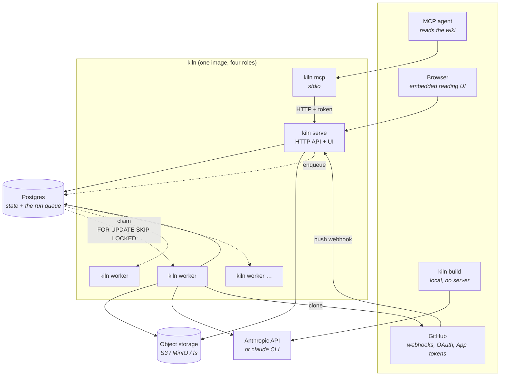

**Roles.** `kiln serve` runs the HTTP API and the embedded reading UI.
`kiln worker` claims queued runs and builds them. `kiln build` runs the same
pipeline against a local directory with no server and no database. `kiln mcp`
serves a bench to agents over stdio, reading through the API rather than the
database (see [Serving the wiki to agents](#serving-the-wiki-to-agents)).
`kiln serve --with-worker` runs the first two in one process, which is the
right shape for a single node.

Only `serve` and `worker` touch Postgres, which is why only those two have
pool settings. `build` needs neither a server nor a database; `mcp` needs a
reachable `serve`.

**Scaling.** Builds scale by adding worker processes. There is no external
broker — the queue *is* the `runs` table, claimed with `FOR UPDATE SKIP LOCKED`.
An external queue was deliberately rejected: LLM-bound jobs at runs-per-hour
throughput gain nothing from one, and would lose the single-transaction
claim-and-state-change this gets for free.

One worker process builds **one run at a time**. Per-process concurrency would
multiply spend rather than throughput, since builds are model-bound and take
minutes. Concurrency *within* a run is a separate, opt-in knob
(`agent.unit_concurrency`).

Postgres pool sizes differ by role — 20 connections for a server, 6 for a
worker. The server issues many short queries; the worker holds a few long-lived
transactions during import. A worker sized like a server would exhaust Postgres
as replicas scale, for no benefit.

---

## Core concepts

**Unit.** The granularity at which regeneration is decided: one code module, one
document, one web page, one document section. A unit carries a `Hash` over its
content, and that hash is what decides whether a model call happens at all.

**Key.** A unit's stable identity, namespaced by prefix:

| Key form | Means |
| --- | --- |
| `module:apps-ripple` | A code module |
| `doc:upload:reports/q3.pdf` | An uploaded document |
| `doc:web:https://example.com/x` | A fetched web page |
| `arch:overview` | The architecture synthesis (a singleton) |

Namespacing is load-bearing: an uploaded `README.md` can never collide with a
repository's `README.md`, and *which namespaces a run synced* is what decides
which disappearances count as deletions.

**Source record.** The persisted memory of one unit: what it hashed to last
time, which pages it wrote, which blobs it referenced, and which connector
produced it. `FilesWritten` is what makes cascade deletion possible at all.

**Page types.** Six agent-writable types plus a deterministic overview. The
directory and the frontmatter `type` must agree, which validation enforces.

| Type | Directory | Agent-writable |
| --- | --- | --- |
| `entity` | `entities/` | yes |
| `concept` | `concepts/` | yes |
| `source` | `sources/` | yes |
| `query` | `queries/` | yes |
| `comparison` | `comparisons/` | yes |
| `synthesis` | `synthesis/` | yes |
| `overview` | (root) | **no** |

Reserved paths — `index.md`, `overview.md`, `log.md` — are emitted
deterministically and are never agent-writable.

**Slug.** The database's page identity: pages are keyed by `(wiki, slug)`, not
by path. Two pages sharing a slug is silent data loss on import, so slug
collisions are rejected at three separate levels (within a batch, against live
pages, and across units of one run).

---

## The build pipeline

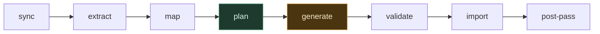

Only **generate** costs money. Everything else is deterministic Go.

The whole flow, with the decisions that can stop it early:

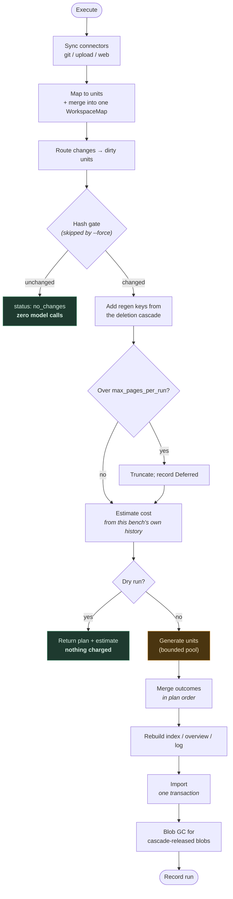

`Execute` is the single entry point shared by the CLI and the worker, so
server-side builds exercise exactly the code path local builds do.

---

## How a build is triggered

Four ways in, all converging on the same `runs` row.

```mermaid
sequenceDiagram
    participant T as Trigger
    participant API as kiln serve
    participant DB as Postgres · runs table
    participant W as kiln worker

    rect rgb(30,40,55)
    note over T,API: manual · webhook · poll · continuation
    T->>API: POST /runs, or push webhook
    API->>API: check workspace budget window
    API->>DB: EnqueueRun, status queued
    note right of DB: a partial unique index allows<br/>one active run per bench
    DB-->>API: existing run if one is active<br/>— debounced, ref_to advanced
    end

    loop poll interval
        W->>DB: requeue stale runs
        W->>DB: poll due connectors → enqueue
        W->>DB: hourly GC sweep
        W->>DB: ClaimNextRun (SKIP LOCKED)
    end

    DB-->>W: run + workspace + org (one round trip)
    W->>W: resolve sources, build, import
    W->>DB: RecordRun (terminal status)
    opt deferred work AND something succeeded
        W->>DB: enqueue continuation
    end
```

**Debounce.** A partial unique index allows only one `queued`-or-`running` run
per workspace. A second enqueue collapses onto the waiting run and *advances its
`ref_to`* to the newest head, so a push storm's final state is what gets built.
A run already claimed is left alone — it loses nothing, because the base of an
incremental range always derives from the workspace's last successful build, not
from the webhook's claim.

**Cooldown.** `github.webhook_cooldown` (default 1 minute) sets `not_before` on
enqueue, so however hard someone pushes, a bench rebuilds at most once a minute.

**Claim.** One statement does the claim and the state change together, so two
workers racing on the same row is impossible: `SKIP LOCKED` makes the loser move
to the next row or come back empty.

**Continuations.** A run that deferred work under the page cap enqueues a
follow-up *when it actually completed something* — only success advances a
source hash, so only success guarantees the next round is smaller. A separate
rule gives a `partial` run exactly one retry: a continuation that goes partial
again stops, because retrying a persistent failure in a loop is a bill, not a
fix.

---

## Sources and connectors

Three connector kinds feed one wiki. Material from all three merges into a
single `WorkspaceMap`, so pages can link across the boundary rather than forming
two wikis that cannot see each other.

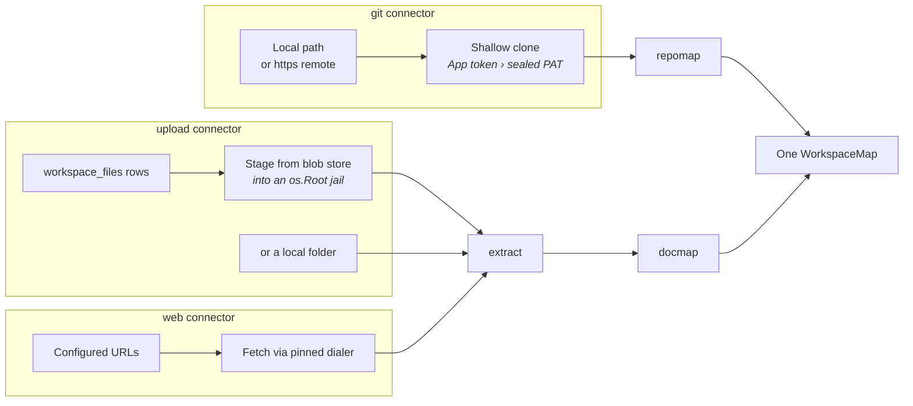

**Repository.** Optional — a bench fed only by documents or web pages builds
without any repository. `repomap` scans the tree, partitions it into modules
(with sub-partitions, so a large repo becomes readable pages rather than one
useless page), and extracts a dependency graph deterministically so dependency
pages are grounded rather than inferred.

**Documents.** Extraction handles `.md`, `.pdf`, `.docx`, `.pptx`, `.xlsx`,
`.epub`, `.html` and more. `docmap` splits a long document into section units so
a 300-page PDF becomes chapters, each independently hash-gated.

**Uploads and staging.** Files uploaded through the API land in object storage.
At sync time the worker stages them into a temp directory through an `os.Root`
jail — even though paths were sanitized at upload, a corrupted row must not be
able to write outside the staging directory.

**Local path safety.** Connector configs are API-writable data. A connector
naming a local path is checked against `worker.permitted_source_roots`, and an
empty allowlist denies every local path — otherwise a connector config would be
a local-file-inclusion primitive. The CLI, whose paths come from the operator's
own command line, is not subject to this.

**Credentials.** Clone auth prefers a GitHub App installation token (short-lived
and repo-scoped, nothing durable to leak) and falls back to a sealed PAT
decrypted just in time. The worker at sync time is the *only* place in kiln that
turns ciphertext back into a secret; plaintext lives in one stack frame and the
clone subprocess's environment.

**Partial failures are not total failures.** A document whose bytes are gone
from storage is skipped, reported to the review queue, and the build continues.
Failing the whole run would stop the repository, the web pages, and every
healthy document from ingesting — turning a storage incident into an outage.

---

## Mapping and routing

Routing answers: *given these changed paths, which units are dirty?*

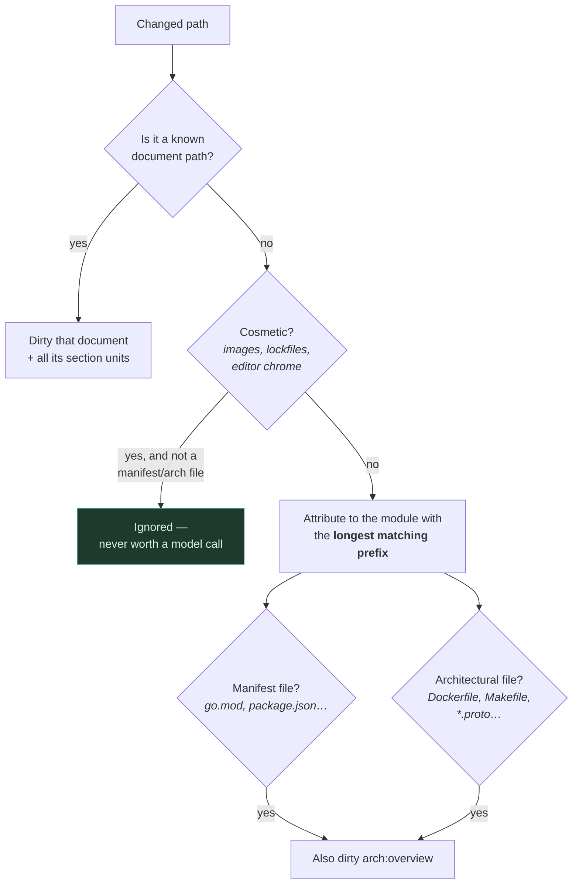

Longest-prefix attribution means a change under `internal/auth` lands on that
service rather than on the repository root. The architecture synthesis is always
planned **last**, so it sees the modules' current state.

Sections ride along with their parent document — they are spans of the same
file, so any reason that dirties the parent makes them candidates, and the hash
gate then drops the chapters that did not actually change.

**Incremental ranges.** A run triggered by a push carries the head it should
build toward; the base is the workspace's own last successful build. Any failure
to use the range falls back to a full hash-gated rebuild — ranges are an
optimization, never a correctness dependency.

---

## The hash gate

This is the primary cost control, and the reason an unchanged sweep is free.

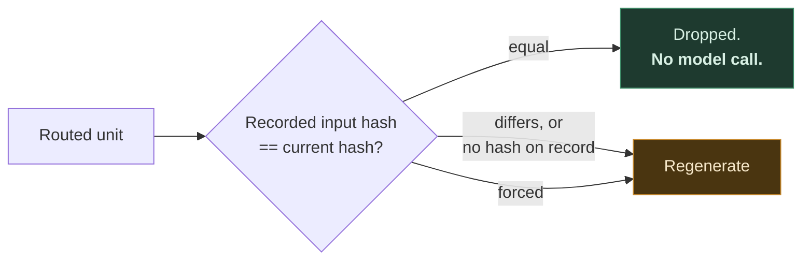

The architecture synthesis has no unit of its own, so the **whole-map hash**
gates it. Without that, every build — including a completely unchanged one —
would pay for an architecture regeneration.

A source record is updated **only on success**. A failed unit keeps its old
hash, so it is planned again on the next run. That single rule is what makes
failure self-healing, and it is also why a run that completes nothing cannot
make progress by repeating itself.

---

## Generation

Two model calls per unit: **analyze**, then **generate**. Analysis produces the
plan (which pages, at which paths) and is not re-run on retry — only generation
failed, and the plan does not change because a page body was malformed.

(A third step, **research**, exists outside this pass: it answers one review
item against the corpus and returns no pages. See
[Research runs](#research-runs).)

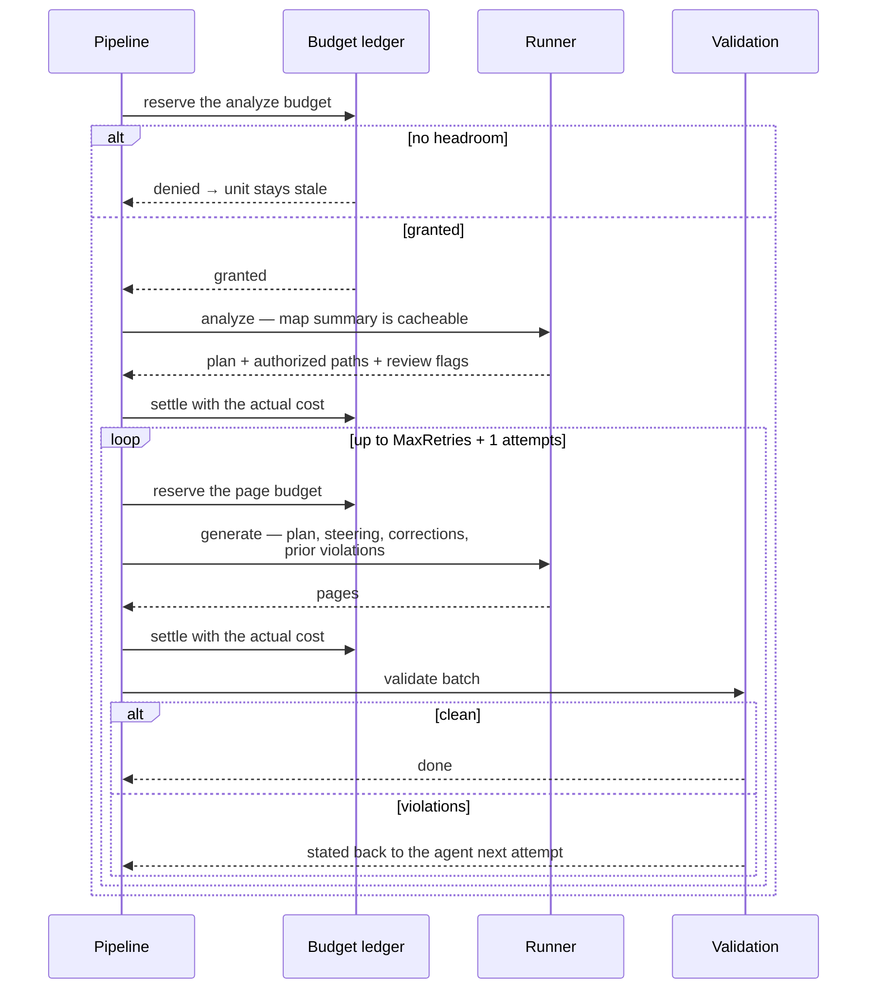

**Prompt caching.** The rendered map summary is identical for every unit in a
run, so it rides the cache breakpoint — all but the first unit reads it at a
fraction of the input rate.

**Retries escalate.** The fallback model is used only on the final attempt,
rather than starting expensive.

**Concurrency.** `agent.unit_concurrency` (default 1) fans generation out over a
bounded pool. This is what makes a large bench build in minutes rather than
hours. Raising it changes real semantics, all handled explicitly:

| At concurrency 1 | At concurrency > 1 |
| --- | --- |
| Slug collisions caught by a growing set | Caught explicitly when outcomes merge |
| Links resolve against pages written so far | Deferred, then resolved against the **whole run** — so cross-unit links work rather than merely surviving |
| A dangling link is corrected inside the retry loop | Deferred, so the correction is lost; this is why concurrency 1 keeps the inline check |
| Budget checked between units | Reserved before each call, settled after |

Outcomes are merged **serially, in plan order**, never in completion order. Two
units can collide on a page path or slug, and the loser must be the same one on
every run regardless of which finished first — otherwise a rerun would produce
different records from identical inputs.

---

## Validation

Four layers, each catching what the one before it cannot see.

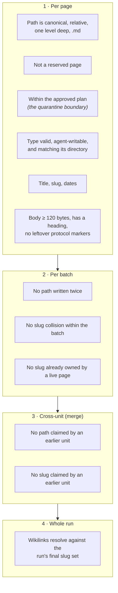

A stub page — a heading and nothing else — is rejected, because it looks like
coverage while being worse than no page at all. An agent that runs low on budget
tends to emit exactly that.

Violations are returned *all at once*, not first-only, so a single corrective
turn can address them all. A unit that fails validation after its retries keeps
its stale hash and is picked up by the next run.

---

## Import and the derived artifacts

Import is one transaction, serialized per workspace by a transaction-scoped
advisory lock. Two concurrent imports would interleave read-modify-write on
pages, links, and artifacts with last-writer-wins results.

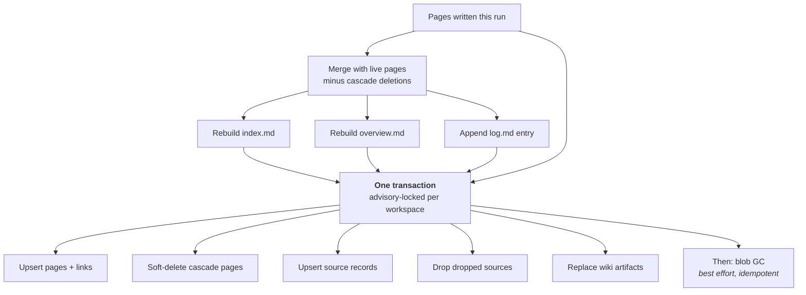

The derived artifacts are rebuilt from what pages *now* exist, so they cannot
drift from the content. Blob GC deliberately rides the moment *after* import:
only once the sources referencing those blobs are durably dropped is deleting
them safe. A failed delete leaves an orphan for a later sweep, never a dangling
reference.

**Import runs on an uncancelable context.** The money is already spent, so a
canceled run must still persist what it produced and what it cost. If import
itself fails, the run is still ledgered — otherwise budget windows would
undercount forever.

---

## Deletion

Nothing is ever deleted because a source vanished. A suspended token and a
genuine deletion look identical at the sync layer, so a disappearance is a
*question*, not a command.

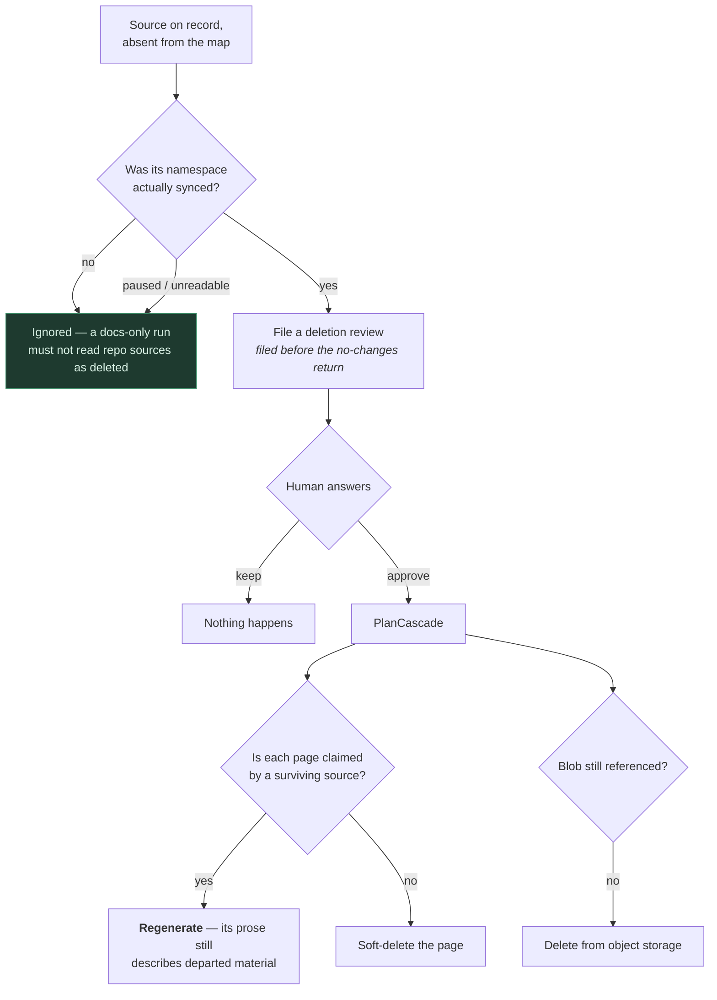

Two rules carry the weight here. A page claimed by another live source is
**kept** — deleting one of three modules must not destroy a concept page derived
from all three. And a kept page is marked for **regeneration**, not merely
amended, because its body still describes material that no longer exists, and
leaving that is how a wiki accumulates confident claims about deleted code.

Deleted pages are soft-deleted and swept after `storage.soft_delete_retention`
(default 30 days).

---

## The human loop

Pages are never hand-edited — regeneration would clobber the edit. Human
judgment enters through three durable channels instead.

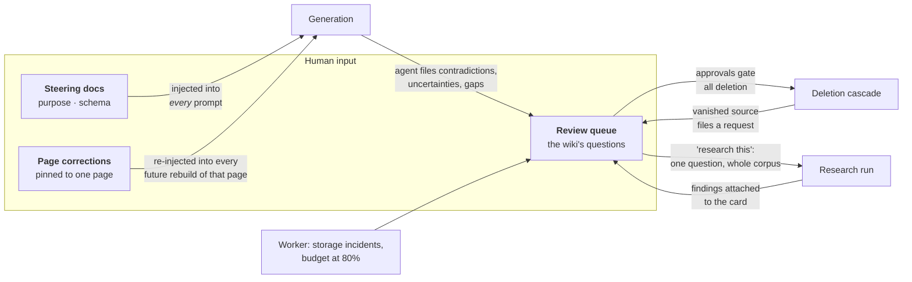

**Steering** (`purpose`, `schema`) is the main lever for changing a wiki's
character without touching code. **Corrections** are how what you teach the wiki
survives regeneration. The **review queue** is where the wiki asks its humans
about things it would otherwise have to guess at — and it is the only path to
deletion.

### Research runs

A question of kind `contradiction`, `uncertain`, or `gap` can be handed back to
the worker instead of answered from scratch. `POST /reviews/{id}/research`
files a run whose `review_id` is set; the worker claims it through the same
queue, resolves the same connectors, and calls `Pipeline.Research` instead of
`Execute`.

The premise is that these questions exist because of how builds are *shaped*,
not because the answer is unavailable. A build generates unit by unit, and each
unit sees one slice of the material — so a module that contradicts a document,
or a claim corroborated two directories away, is genuinely unanswerable from
where the unit stood. Research is the read that does not stand there.

- **One call, no pages.** The research schema returns findings, evidence, and a
  `resolved` flag; it has no `pages` field at all, so the step cannot become a
  second generation path into the wiki with none of the validation the first
  one has. Turning findings into prose is the next build's job, through
  steering or a correction someone writes after reading them.
- **Go picks the material.** Which units and pages the question is rendered
  against is decided by term overlap in `relevantUnits`/`relevantPages`, before
  the model is involved — deterministic and inspectable, like routing and
  planning. A wrong pick costs tokens and an "I could not settle this", not a
  wrong page.
- **No new network surface.** Research reads what the connectors already
  fetched. The agent's denied-tool list is unchanged.
- **Evidence, not authority.** Findings land on the card and the item stays in
  the queue. Only a pass that reports the question conclusively settled closes
  it, and a deletion is never researchable — that needs authority, not reading.
- **In flight is derived, never stored.** Whether a read is running comes from
  the run queue, so a worker that dies mid-read leaves a run the stale-requeue
  handles rather than a question the queue refuses to let anyone answer.
  Resolving an item drops its still-queued research run: the money would buy an
  answer to a settled question.

---

## Cost control

Six independent layers, from cheapest to last resort.

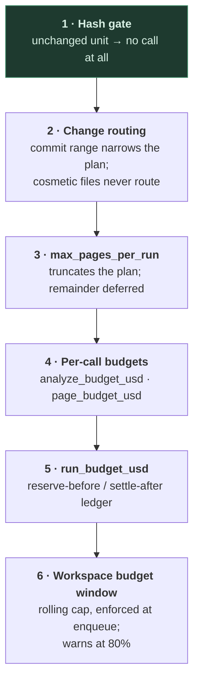

**The run ledger is the subtle one.** A sequential loop could enforce a ceiling
by accumulating spend and checking before each unit — with one call in flight,
check and charge cannot interleave. Fan-out breaks that: *C* units reading one
snapshot of spend would each conclude the whole remaining budget was theirs, and
the ceiling would scale with concurrency. So the reservation is taken **before**
each call and settled after. Outstanding reservations plus settled spend never
exceed the limit, at any concurrency.

A unit that cannot reserve stops exactly where the sequential loop would have
stopped scheduling: stale, and picked up by the next run.

**Estimates.** A preview is what a human approves spend against, so the estimate
prefers this workspace's own trailing cost history over the global default — a
bench whose pages run expensive should say so *before*, not after.

**An unpriceable model is refused.** On runners that estimate from the pricing
table, an unknown model id prices every call at $0 and silently disables the
budget — the opposite of what configuring a budget asked for. A budgeted run
with an unknown model id refuses to start.

---

## Data model

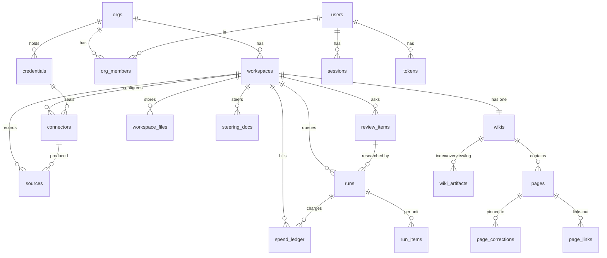

Points worth knowing:

- **`runs` is the queue.** `status`, `claimed_by`, `claimed_at`, `not_before`,
  `ref_to`. A partial unique index on `(workspace_id) WHERE status IN
  ('queued','running')` is what makes debouncing work.
- **Pages are keyed by `(wiki_id, slug)`** via a unique index restricted to
  `deleted_at IS NULL`, so a soft-deleted page frees its slug.
- **Full-text search** is a GIN index on a `search` column.
- **`page_links`** carries unresolved links too (`to_page_id` null), which is
  what makes the gaps view possible.
- **`spend_ledger` is never swept.** Budget windows read it; run deletion nulls
  its `run_id` rather than cascading into it.

**Run statuses:** `pending`, `running`, `succeeded`, `partial`, `failed`,
`no_changes`, `over_budget`, `canceled`.

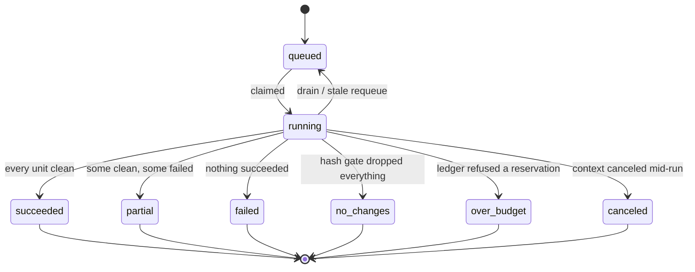

---

## HTTP API and auth

Everything is under `/api/v1`. The middleware derives the required scope from
the HTTP method — `read` for safe methods, `write` for everything else — so a
mutating route added tomorrow is covered the day it is added rather than the day
someone remembers.

Admin routes (connectors, credentials, members) are gated **twice**: the token
must carry the `admin` scope, *and* the caller must be an instance admin or an
**owner** of that bench's org. A token minted for automation should not be able
to reshape a bench's sources just because its holder happens to be an owner —
and a connector config is a security boundary, a credential is a secret, so
neither is a thing an editor role should shape.

Org membership is resolved per query rather than snapshotted into the identity,
so a revoked membership takes effect immediately.

| Group | Routes |
| --- | --- |
| Health | `GET /healthz`, `GET /readyz` |
| Identity | `GET /auth/github/login`, `/callback`, `POST /auth/logout`, `GET /me` |
| Reading | `GET /workspaces`, `/workspaces/{ws}`, `/pages`, `/pages/*`, `/index`, `/overview`, `/log`, `/search`, `/gaps`, `/graph`, `/backlinks/{slug}` |
| Runs | `GET /runs`, `GET /runs/{id}/items`, `POST /runs` |
| Sources *(admin)* | `GET`/`POST /connectors`, `PATCH`/`DELETE /connectors/{id}`, `GET`/`POST /credentials`, `DELETE /credentials/{id}` |
| Files | `GET /files`, `POST` upload, `PATCH`/`DELETE /files/{id}` |
| Human loop | `GET`/`PUT /steering[/{kind}]`, `GET`/`POST /corrections/*`, `PATCH /correction/{id}`, `GET /reviews`, `POST /reviews/{id}/resolve`, `POST /reviews/{id}/research` |
| Members *(admin)* | `GET`/`POST /members`, `PATCH`/`DELETE /members/{userID}` |

**Auth modes.** `token` is the default — a shared deployment must opt *out* of
authentication deliberately rather than arrive without it by omission. `none`
makes every caller an admin, and kiln refuses it on a non-loopback bind.

Browser sessions act with the user's full authority; scopes exist to narrow
*automation* tokens. Sessions are server-side rows, so a stolen cookie is
revocable.

**Rate limiting** applies to write routes. **Uploads** get a 5-minute timeout
instead of the API-wide 30 seconds, and accept up to 32 MiB per file — a reverse
proxy in front of kiln needs its body limit raised to match (nginx:
`client_max_body_size 34m`).

**Metrics are on a separate listener** (`:9090` by default). They describe the
deployment, not a tenant; putting them on the public router would mean either
publishing queue depth and spend to every reader or inventing an auth scheme
Prometheus does not want to use.

---

## Serving the wiki to agents

`kiln mcp` exposes a bench over the Model Context Protocol on stdio. The wiki
is already the artifact worth reading — prose compiled from sources and kept
current — so an agent that can reach it answers from compiled knowledge instead
of re-deriving it from raw material on every question.

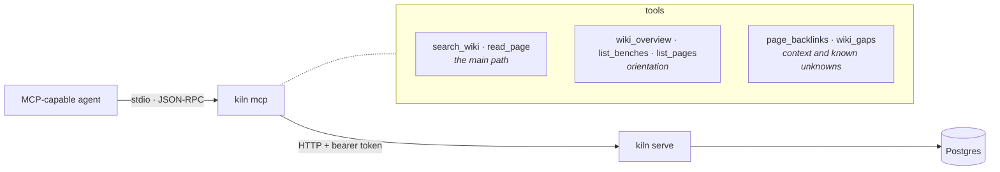

Three decisions shape it:

**It reads the HTTP API, not the database.** An agent's machine needs no
Postgres credentials, the server works against a kiln running anywhere, and the
token it carries decides what it can see — so an agent reads exactly the benches
that token reads.

**Search-first, seven tools.** An agent that can search, read, and follow links
has what it needs; a tool per endpoint would spend the model's attention on
choosing between them. `search_wiki` returns slugs and snippets, `read_page`
takes those slugs back.

**Failures are tool errors, not protocol errors.** An unknown bench or a missing
page is a normal thing for an agent to hit, so each one returns text naming the
recovery (`list_benches` for the former, `search_wiki` for the latter) rather
than a transport failure the host reports as a broken server.

Two details exist because the model is the reader. `wiki_gaps` distinguishes
*"the wiki says nothing about X"* from *"the wiki has not covered X yet"*, which
is the difference between a confident negative answer and an unanswered
question. And Postgres marks search matches with `[[[term]]]`, which the reading
UI renders as a highlight but a model reads as a wikilink to a page named
`term`; the MCP layer rewrites those markers to bold so no phantom link
survives.

## Failure and recovery

| Situation | Behavior |
| --- | --- |
| One unit fails | Recorded against that unit; the run imports everything else and goes `partial`. The failed unit keeps its stale hash and retries next run. |
| Validation fails | Errors are stated back to the agent and generation retries; the final attempt escalates to the fallback model. |
| Run budget exhausted | Scheduling stops. In-flight units finish — paid-for calls are not thrown away. Remaining units stay stale. |
| Ctrl-C / cancellation | Stops scheduling; already-generated units are still imported, on an uncancelable context. |
| Rolling deploy | Shutdown drains: the in-flight run keeps a detached context for `worker.drain_grace` (default 15m, above one agent call). Past that it is interrupted and **requeued, not failed**. |
| Worker dies mid-build | Its run sits `running` and would block the bench via the active-run index. `worker.stale_after` (default 45m) returns it to the queue. The pipeline is idempotent from the start. |
| Import fails | The run is marked failed **and still ledgered**, because the agent calls are already billed. |
| Blob missing at sync | That document is skipped and reported to the review queue; the rest of the bench builds. |
| Blob delete fails | Logged; an orphan is left for a later sweep. Never a dangling reference. |
| Postgres briefly unavailable | Connection is retried with backoff at startup. |

The GC sweep runs roughly hourly inside the worker: soft-deleted pages past
their window, finished runs past theirs, expired sessions, and dead tokens
(which linger a week past death so an operator can still see what a failing
client was presenting).

---

## Configuration reference

Every setting binds to an environment variable: the config key, `KILN_`
prefixed, dots as underscores — `agent.model` is `KILN_AGENT_MODEL`. An empty
variable is ignored rather than applied. Secrets also accept a `_FILE` suffix
pointing at a mounted file, which is how Docker and Kubernetes secrets should
deliver them.

### Server

| Key | Default | Notes |
| --- | --- | --- |
| `http_addr` | `:8080` | API and UI listener. |
| `metrics_addr` | `:9090` | Separate Prometheus listener. Empty disables. |
| `public_url` | — | External URL, for OAuth callbacks and links. |
| `log_level` | `info` | |
| `cors_origins` | — | Empty means same-origin only. |

### Database

| Key | Default | Notes |
| --- | --- | --- |
| `database.url` | — | Wins when set; otherwise assembled from the fields below. |
| `database.host` / `.port` / `.name` / `.user` | `localhost` / `5432` / `kiln` / `kiln` | |
| `database.password` | — | |
| `database.sslmode` | `require` | Deliberately not `disable` — opt out of TLS on purpose, not by omission. |
| `database.sslrootcert` | — | |
| `database.max_conns` | `20` server / `6` worker | Role-dependent; see [Topology](#topology). |
| `database.min_conns` | `2` | |
| `database.max_conn_lifetime` | `1h` | |
| `database.max_conn_idle_time` | `15m` | |

### Agent

| Key | Default | Notes |
| --- | --- | --- |
| `agent.runner` | `api` | Names a registered provider. Shipped: `api` (structured output, no filesystem), `cli` (shells out to `claude`), `fake` (deterministic, zero spend). Not a closed set — see extension points. |
| `agent.settings` | — | Provider-specific configuration, passed through untouched to the selected provider. |
| `agent.binary` | `claude` | CLI runner only. |
| `agent.base_url` | — | Endpoint override, mainly for testing. |
| `agent.effort` | `high` | Thinking depth: `low`…`max`. |
| `agent.model` | `claude-sonnet-5` | Flipping this default would silently multiply every bench's bill. |
| `agent.analyze_model` | `claude-sonnet-5` | |
| `agent.fallback_model` | `claude-sonnet-5` | Used only on the final retry. |
| `agent.timeout` | `12m` | Per agent call. |
| `agent.analyze_budget_usd` | `0.40` | Per analyze call. |
| `agent.page_budget_usd` | `1.50` | Per generate call. |
| `agent.run_budget_usd` | `6.00` | Hard ceiling per run, at any concurrency. |
| `agent.max_pages_per_run` | `12` | Excess is deferred to a continuation. |
| `agent.unit_concurrency` | `1` | **The throughput knob.** See [Generation](#generation). |
| `agent.budget_window` | `720h` (30d) | Rolling workspace cap window. Zero disables. |
| `agent.warn_turns` | `40` | Logs a warning; early sign of a runaway session. |
| `agent.fake_cost_usd` | `0.01` | Synthetic cost so dev exercises cost plumbing. |
| `agent.fake_fail_units` | — | Substring match; injects failures for testing partial runs. |
| `agent.fake_latency` | — | Slows fake calls to watch state transitions. |

### Worker

| Key | Default | Notes |
| --- | --- | --- |
| `worker.poll_interval` | `5s` | Idle queue re-check. |
| `worker.stale_after` | `45m` | Above `agent.timeout`, so only a genuinely dead worker's run is requeued. |
| `worker.source_poll_interval` | `10m` | Poll-triggered connectors. Zero disables the scheduler. |
| `worker.drain_grace` | `15m` | Above one agent call, so a deploy does not throw away paid work. |
| `worker.permitted_source_roots` | — | **Empty denies every local path.** Security boundary, not a convenience. |

### Storage

| Key | Default | Notes |
| --- | --- | --- |
| `storage.backend` | `s3` | `s3` or `fs`. `fs` is single-node only. |
| `storage.endpoint` / `.region` / `.bucket` | — / `us-east-1` / `kiln` | |
| `storage.access_key` / `.secret_key` | — | Omit to use the instance role / IRSA / workload identity chain. |
| `storage.use_ssl` | `true` | |
| `storage.path_style` | `true` | Required by MinIO; AWS uses virtual-host addressing. |
| `storage.path` | `/var/lib/kiln/blobs` | `fs` backend only. |
| `storage.run_artifact_retention` | `720h` (30d) | |
| `storage.soft_delete_retention` | `720h` (30d) | |

### Auth and GitHub

| Key | Default | Notes |
| --- | --- | --- |
| `auth.mode` | `token` | `none` refused on a non-loopback bind. |
| `github.client_id` | — | Empty disables sign-in. |
| `github.app_id` / `.app_slug` | — | For installation tokens and the install page. |
| `github.base_url` / `.api_base_url` | github.com | For GitHub Enterprise. |
| `github.session_ttl` | `720h` (30d) | Sessions are revocable rows regardless. |
| `github.webhook_cooldown` | `1m` | At most one rebuild per bench per minute. Zero disables. |

### Secrets

Never logged or serialized; kept off the main config structs so an accidental
`%+v` cannot leak them.

| Variable | Purpose |
| --- | --- |
| `KILN_MASTER_KEY` | Seals connector credentials. 32 random bytes. Rotate with `kiln admin rotate-key`. |
| `KILN_ANTHROPIC_API_KEY` | Spent by generation. |
| `KILN_SESSION_SECRET` | Browser session signing. |
| `KILN_GITHUB_CLIENT_SECRET` | OAuth sign-in. |
| `KILN_GITHUB_PRIVATE_KEY` | App installation tokens. |
| `KILN_GITHUB_WEBHOOK_SECRET` | Webhook signature verification. |
| `KILN_STORAGE_SECRET_KEY` | Object storage. |

`kiln admin doctor` validates configuration, database reachability, and schema
version in one pass.

---

## Extension points

**A new connector** implements `Kind()` and `Sync(ctx, config, staging)`,
returning a `SourceSet`, and registers itself with the connector registry. If
its material needs a change-source for incremental routing, its paths must be
emitted through a namespacing helper (`diff.UploadOrigin`, `diff.WebOrigin`) so
they stay routable and cannot collide with another namespace.

**A new mapper** implements `Kind()` and `Map(ctx, set)`, returning a
`WorkspaceMap` of units with content hashes. The hash is the contract — get it
wrong and either nothing regenerates or everything does.

**A new model provider** implements `Name()` and `New(agent.Options) (Runner, error)`
and registers itself with `agent.RegisterProvider`, the same shape as a source
connector. The runner it returns implements `Run(ctx, Request) (*Result, error)`.
Two delivery shapes already exist and the pipeline treats them identically past
the collection point: structured pages as data (the API runner), or files
written into a scratch directory (the CLI runner).

A provider says which shape it is — and whether its costs are measured or
estimated — by implementing `Capabilities()`, because the pipeline branches on
both. `WritesFiles` decides whether a scratch directory is allocated at all;
`EstimatesCost` decides whether the run budget is enforced against a local
pricing table, where a cost of zero means "no entry for this model" rather than
"free". A provider that declares nothing gets the conservative pair (data, and
authoritative cost), which is what keeps the pipeline's own test fakes working
without implementing anything.

Provider-specific configuration travels in `agent.settings`, a free-form map
handed through untouched, so reaching a new model never means widening
`config.Agent` with a field only one provider reads. Which providers exist is a
property of the binary rather than a list in the config package: an unknown
`agent.runner` fails when the runner is built, with an error naming the
providers actually registered.

**A new page type** needs an entry in `typeDirs` and `GeneratedTypes`. The
directory names are part of the on-disk contract with Obsidian and the
`llm_wiki` export, which is why they are spelled out rather than derived.
